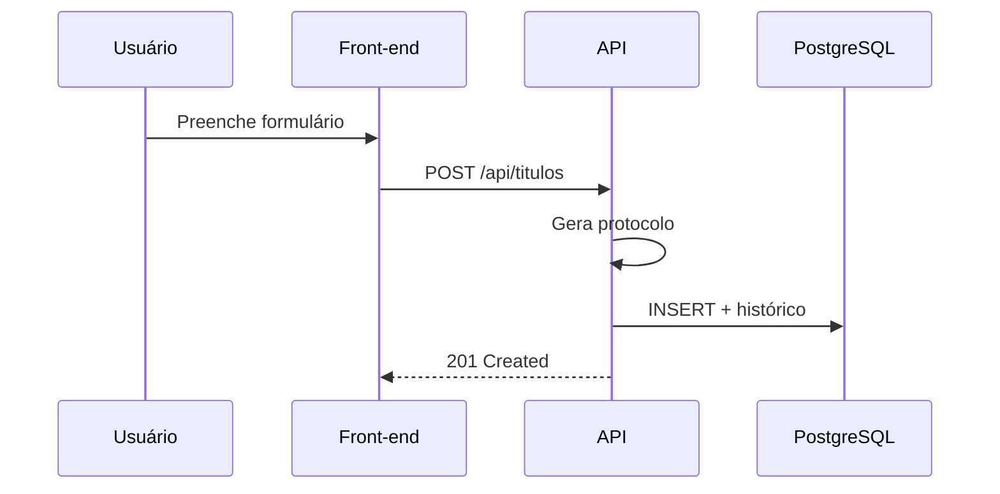
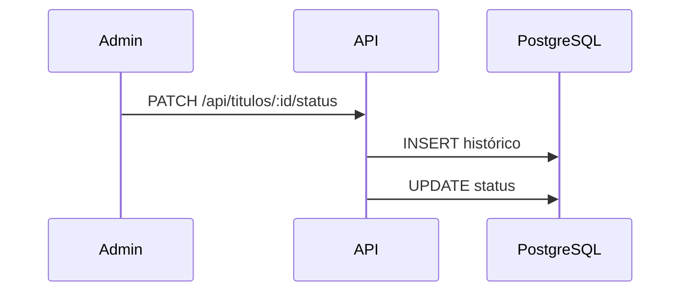
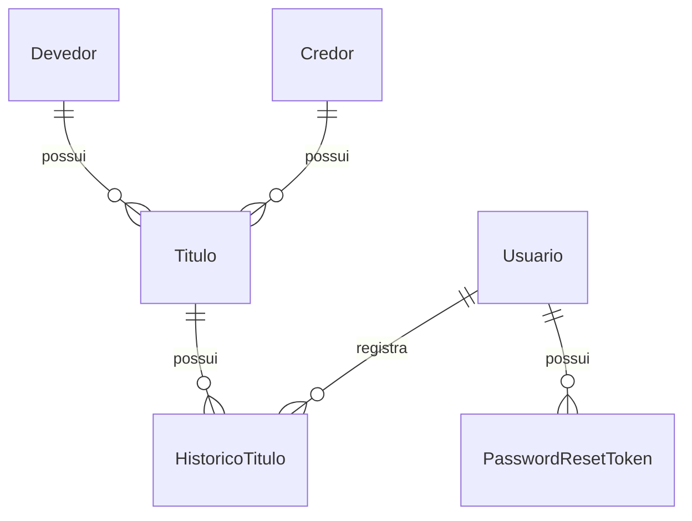
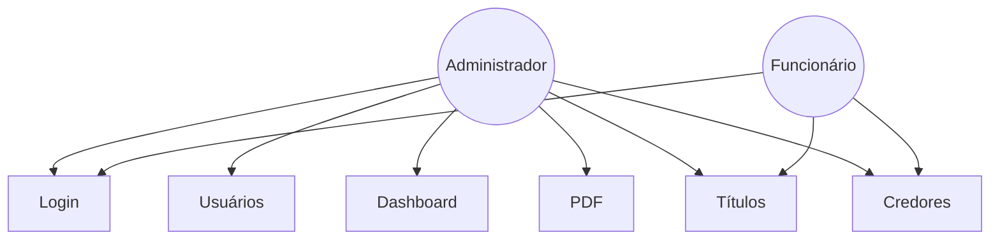

# Specify — Especificação do Sistema de Gerenciamento de Protesto de Títulos

## 1. Visão Geral

Sistema web para gerenciamento de títulos encaminhados para protesto em ambiente cartorial simulado. Usuários autenticados (Administrador ou Funcionário) gerenciam credores, devedores e títulos, acompanham status de protesto, consultam histórico e emitem comprovantes.

---

## 2. Requisitos Funcionais

| ID | Descrição |
|---|---|
| RF01 | Cadastro de usuários |
| RF02 | Autenticação (login) |
| RF03 | Recuperação de senha |
| RF04 | Cadastro de devedores |
| RF05 | Cadastro de credores |
| RF06 | Cadastro de títulos |
| RF07 | Edição de títulos |
| RF08 | Exclusão de títulos |
| RF09 | Pesquisa de títulos |
| RF10 | Filtros: protocolo, CPF/CNPJ, nome, status, data |
| RF11 | Alteração de status do protesto |
| RF12 | Geração automática de protocolo |
| RF13 | Histórico de alterações |
| RF14 | Emissão de comprovante PDF |
| RF15 | Dashboard com indicadores |

---

## 3. Requisitos Não Funcionais

| ID | Descrição |
|---|---|
| RNF01 | Front-end React |
| RNF02 | Back-end Node.js |
| RNF03 | TypeScript |
| RNF04 | PostgreSQL no Supabase |
| RNF05 | API REST |
| RNF06 | ORM Prisma |
| RNF07 | Autenticação JWT |
| RNF08 | Bcrypt para senhas |
| RNF09 | Interface responsiva |
| RNF10 | Resposta < 2 segundos |
| RNF11 | Clean Code |
| RNF12 | Arquitetura MVC |
| RNF13 | Git |
| RNF14 | Deploy front Vercel |
| RNF15 | Deploy back Render |
| RNF16 | Banco Supabase |
| RNF17 | Variáveis de ambiente |
| RNF18 | DATABASE_URL e DIRECT_URL |

---

## 4. Casos de Uso

### UC01 — Autenticar Usuário
**Ator:** Admin/Funcionário | **Fluxo:** email + senha → JWT

### UC02 — Cadastrar Usuário
**Ator:** Administrador | **Regra:** apenas ADMIN

### UC03 — Cadastrar Devedor
**Ator:** Admin ou Funcionário | **Validação:** CPF/CNPJ

### UC04 — Cadastrar Credor
**Ator:** Admin ou Funcionário

### UC05 — Cadastrar Título
**Ator:** Admin ou Funcionário | **Resultado:** protocolo + status PENDENTE

### UC06 — Alterar Status
**Ator:** Administrador | **(A DEFINIR)** permissões do Funcionário

### UC07 — Pesquisar Títulos
**Ator:** Autenticado | **Filtros:** RF10

### UC08 — Emitir PDF
**Ator:** Administrador

### UC09 — Dashboard
**Ator:** Administrador

### UC10 — Recuperar Senha
**Ator:** Usuário | **(A DEFINIR)** SMTP

---

## 5. Fluxos Principais

### Cadastro de Título

### Alteração de Status

---

## 6. Fluxos Alternativos

| Caso | Resposta |
|---|---|
| Credenciais inválidas | 401 |
| CPF/CNPJ inválido | 400 |
| Funcionário exclui | 403 |
| Token expirado | 401 |

---

## 7. Entidades e Atributos

Ver implementação em `backend/prisma/schema.prisma`: Usuario, Credor, Devedor, Titulo, HistoricoTitulo, PasswordResetToken.

---

## 8. Relacionamentos — DER

---

## 9. Regras de Negócio

RN01–RN14 conforme especificação do projeto (protocolo único, CPF/CNPJ válidos, valor positivo, histórico obrigatório, exclusão ADMIN, auth JWT/Bcrypt, Supabase).

---

## 10. Status do Protesto

PENDENTE, EM_ANALISE, PROTESTADO, CANCELADO, RETIRADO, PAGO.

> **(A DEFINIR):** Transições válidas e prazos legais.

---

## 11. Validações

| Campo | Regra |
|---|---|
| CPF | 11 dígitos + verificadores |
| CNPJ | 14 dígitos + verificadores |
| Valor | > 0 |
| Protocolo | PROT-YYYYMMDD-NNNNN |
| Senha | mín. 6 caracteres |

---

## 12. Diagrama de Casos de Uso

---

## 13. Pontos em Aberto

- **(A DEFINIR)** Tipos formais de título
- **(A DEFINIR)** Transições de status
- **(A DEFINIR)** SMTP recuperação senha
- **(A DEFINIR)** Endereço obrigatório para protesto
