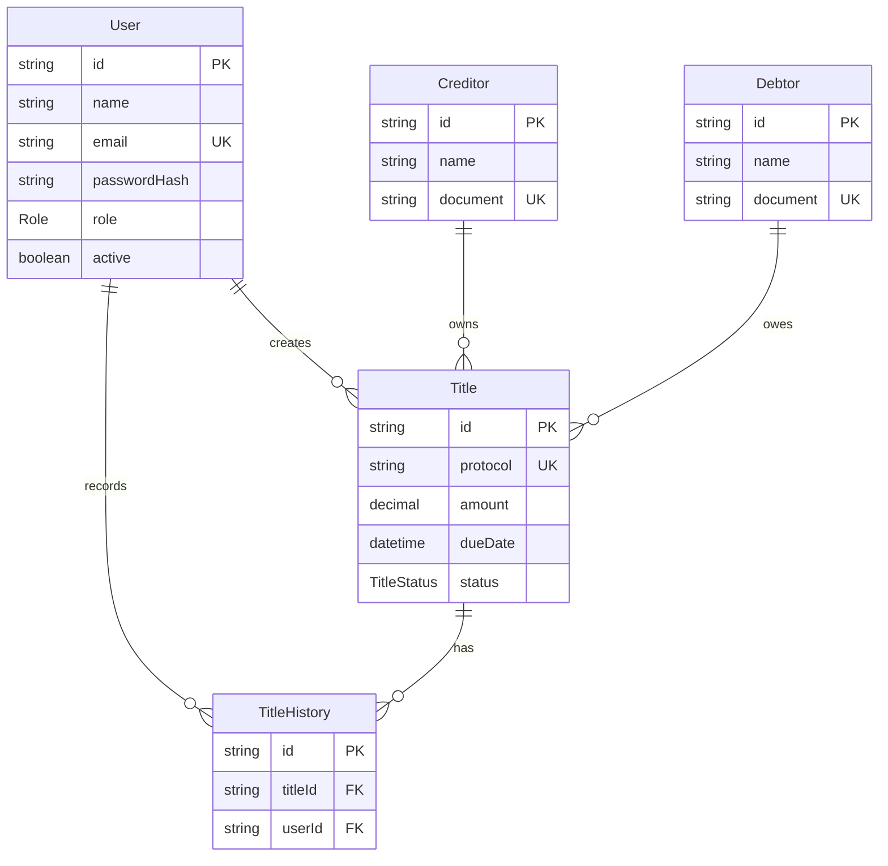

# Specify

## Visao Geral

O sistema gerencia titulos encaminhados para protesto, credores, devedores, usuarios e historico de alteracoes. O fluxo central e o cadastro de um titulo com protocolo unico, acompanhamento de status e emissao de comprovante.

## Requisitos Funcionais

- RF01: cadastrar usuarios.
- RF02: autenticar usuarios.
- RF03: recuperar senha. Implementacao operacional por redefinicao administrativa; envio de email fica (A DEFINIR).
- RF04: cadastrar devedores.
- RF05: cadastrar credores.
- RF06: cadastrar titulos.
- RF07: editar titulos.
- RF08: excluir titulos.
- RF09: pesquisar titulos.
- RF10: filtrar por protocolo, CPF/CNPJ, nome, status e data.
- RF11: alterar status do protesto.
- RF12: gerar protocolo automaticamente.
- RF13: registrar historico.
- RF14: emitir comprovante em PDF.
- RF15: exibir dashboard com indicadores.

## Requisitos Nao Funcionais

React, Node.js, TypeScript, PostgreSQL Supabase, API REST, Prisma, JWT, Bcrypt, responsividade, resposta inferior a 2 segundos em operacoes comuns, Clean Code, deploy em Vercel e Render.

## Casos de Uso

- UC01 Login: usuario informa email e senha, recebe JWT e acessa o sistema.
- UC02 Gerenciar usuarios: administrador cria, edita, remove e redefine senhas.
- UC03 Gerenciar credores: usuario autenticado cadastra e consulta credores.
- UC04 Gerenciar devedores: usuario autenticado cadastra e consulta devedores.
- UC05 Gerenciar titulos: usuario autenticado cadastra, consulta e edita titulos.
- UC06 Alterar status: usuario autorizado altera status e gera historico.
- UC07 Emitir protocolo: sistema gera comprovante PDF do titulo.
- UC08 Dashboard: usuario visualiza indicadores.

## Fluxos Principais

1. Usuario realiza login.
2. Backend valida senha com Bcrypt.
3. Backend gera JWT.
4. Front-end armazena token.
5. Usuario cadastra credor e devedor.
6. Usuario cadastra titulo.
7. Sistema gera protocolo unico.
8. Sistema registra historico inicial.
9. Usuario consulta e filtra titulos.
10. Usuario altera status.
11. Sistema registra historico da alteracao.

## Fluxos Alternativos

- CPF/CNPJ invalido: API retorna erro de validacao.
- Valor negativo: API retorna erro.
- Usuario sem perfil de administrador tentando excluir: API retorna 403.
- Protocolo duplicado: banco rejeita pela constraint unique e service tenta novo protocolo.
- Recuperacao de senha: administrador redefine senha ate definicao de envio automatico por email (A DEFINIR).

## Entidades

- User: usuarios do sistema.
- Creditor: credores.
- Debtor: devedores.
- Title: titulos protestados.
- TitleHistory: historico de alteracoes.

## Atributos

- User: id, name, email, passwordHash, role, active, createdAt, updatedAt.
- Creditor/Debtor: id, name, document, email, phone, address, city, state, zipCode, createdAt, updatedAt.
- Title: id, protocol, creditorId, debtorId, amount, dueDate, issueDate, status, description, createdById, createdAt, updatedAt.
- TitleHistory: id, titleId, userId, fromStatus, toStatus, field, oldValue, newValue, note, createdAt.

## Regras e Validacoes

- Protocolo unico.
- Titulo possui exatamente um protocolo.
- CPF e CNPJ devem ser validos.
- Valor deve ser positivo.
- Data de vencimento deve ser valida.
- Exclusao apenas por administrador.
- Acesso apenas autenticado.
- Senhas com hash Bcrypt.
- Regras cartorarias especificas de prazos, intimacao, emolumentos e cancelamento ficam (A DEFINIR).

## DER

