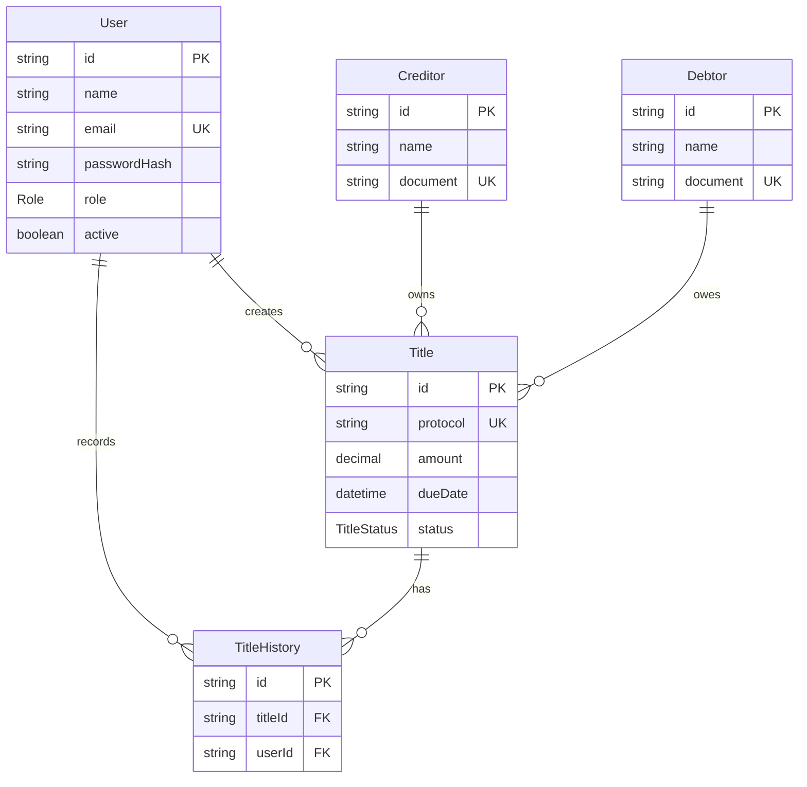

# Specify

## Visao Geral

O sistema gerencia protestos importados por arquivo, credores, devedores, usuarios, lotes de importacao, erros, anexos, pagamentos e historico de alteracoes. O fluxo central e importar ou registrar um protesto com protocolo unico, acompanhar status, boleto, pagamento e emitir comprovante.

## Requisitos Funcionais

- RF01: cadastrar usuarios.
- RF02: autenticar usuarios.
- RF03: recuperar senha. Implementacao operacional por redefinicao administrativa; envio de email fica (A DEFINIR).
- RF04: cadastrar devedores.
- RF05: cadastrar credores.
- RF06: cadastrar titulos.
- RF07: editar titulos.
- RF08: excluir titulos.
- RF09: pesquisar titulos.
- RF10: filtrar por protocolo, CPF/CNPJ, nome, status e data.
- RF11: alterar status do protesto.
- RF12: gerar protocolo automaticamente.
- RF13: registrar historico.
- RF14: emitir comprovante em PDF.
- RF15: exibir dashboard com indicadores.

## Requisitos Nao Funcionais

React, Node.js, TypeScript, PostgreSQL Supabase, API REST, Prisma, JWT, Bcrypt, responsividade, resposta inferior a 2 segundos em operacoes comuns, Clean Code, deploy em Vercel e Render.

## Casos de Uso

- UC01 Login: usuario informa email e senha, recebe JWT e acessa o sistema.
- UC02 Gerenciar usuarios: administrador cria, edita, remove e redefine senhas.
- UC03 Gerenciar credores: usuario autenticado cadastra e consulta credores.
- UC04 Gerenciar devedores: usuario autenticado cadastra e consulta devedores.
- UC05 Gerenciar titulos: usuario autenticado cadastra, consulta e edita titulos.
- UC06 Alterar status: usuario autorizado altera status e gera historico.
- UC07 Emitir protocolo: sistema gera comprovante PDF do titulo.
- UC08 Dashboard: usuario visualiza indicadores.

## Fluxos Principais

1. Usuario realiza login.
2. Backend valida senha com Bcrypt.
3. Backend gera JWT.
4. Front-end armazena token.
5. Usuario cadastra credor e devedor.
6. Usuario cadastra titulo.
7. Sistema gera protocolo unico.
8. Sistema registra historico inicial.
9. Usuario consulta e filtra titulos.
10. Usuario altera status.
11. Sistema registra historico da alteracao.

## Fluxos Alternativos

- CPF/CNPJ invalido: API retorna erro de validacao.
- Valor negativo: API retorna erro.
- Usuario sem perfil de administrador tentando excluir: API retorna 403.
- Protocolo duplicado: banco rejeita pela constraint unique e service tenta novo protocolo.
- Recuperacao de senha: administrador redefine senha ate definicao de envio automatico por email (A DEFINIR).

## Entidades

- User: usuarios do sistema.
- ImportBatch: lote de arquivo importado.
- ImportError: erros encontrados durante a importacao.
- Creditor: credores.
- Debtor: devedores.
- Protest: titulo/protesto importado.
- ProtestAttachment: anexos do protesto, incluindo boleto.
- ProtestHistory: historico de alteracoes.
- PaymentInfo: informacoes de pagamento.

## Atributos

- User: id, name, email, passwordHash, role, active, createdAt, updatedAt.
- ImportBatch: id, fileName, fileType, importedById, totalRecords, validRecords, invalidRecords, status, createdAt.
- ImportError: id, importBatchId, lineNumber, field, message, rawContent, createdAt.
- Creditor: id, name, document, documentType, createdAt, updatedAt.
- Debtor: id, name, document, documentType, address, city, state, zipCode, createdAt, updatedAt.
- Protest: id, protocol, titleNumber, debtorId, creditorId, importBatchId, amount, dueDate, presentationDate, status, paymentStatus, hasBoleto, boletoDueDate, boletoAmount, notes, createdAt, updatedAt.
- ProtestAttachment: id, protestId, fileName, fileUrl, fileType, attachmentType, uploadedById, createdAt.
- ProtestHistory: id, protestId, userId, action, oldValue, newValue, description, createdAt.
- PaymentInfo: id, protestId, amount, paymentDate, paymentMethod, status, notes, createdAt.

## Importacao CSV

Cabecalho esperado:

```csv
protocolo,numero_titulo,nome_devedor,documento_devedor,tipo_documento_devedor,nome_credor,documento_credor,tipo_documento_credor,valor,data_vencimento,data_apresentacao,status
```

Campos importados: protocolo, numero do titulo, devedor, documento do devedor, tipo de documento, credor, documento do credor, valor, vencimento, apresentacao e status. Registros invalidos sao preservados como `ImportError`.

Layout SIMPROT/CRA: (A DEFINIR).

## Regras e Validacoes

- Protocolo unico.
- Titulo possui exatamente um protocolo.
- CPF e CNPJ devem ser validos.
- Valor deve ser positivo.
- Data de vencimento deve ser valida.
- Exclusao apenas por administrador.
- Acesso apenas autenticado.
- Senhas com hash Bcrypt.
- Regras cartorarias especificas de prazos, intimacao, emolumentos e cancelamento ficam (A DEFINIR).

## DER


