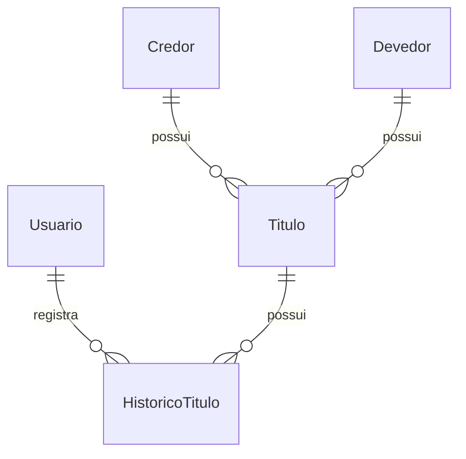

# Specify — Especificação do Sistema

## 1. Visão Geral

Sistema web para gerenciamento de títulos encaminhados para protesto em ambiente cartorial simulado.

## 2. Requisitos Funcionais

RF01–RF15: cadastro usuários, auth, recuperação senha, CRUD credores/devedores/títulos, filtros, status, protocolo, histórico, PDF, dashboard.

## 3. Requisitos Não Funcionais

RNF01–RNF18: React, Node, TypeScript, Supabase, REST, Prisma, JWT, Bcrypt, responsivo, deploy Vercel/Render.

## 4. Casos de Uso

UC01 Login, UC02 Cadastro usuário (ADMIN), UC03 Devedor, UC04 Credor, UC05 Título, UC06 Status, UC07 Pesquisa, UC08 PDF, UC09 Dashboard, UC10 Recuperar senha **(A DEFINIR SMTP)**.

## 5. Entidades

Usuario, Credor, Devedor, Titulo, HistoricoTitulo, PasswordResetToken — ver schema Prisma.

## 6. Status do Protesto

PENDENTE, EM_ANALISE, PROTESTADO, CANCELADO, RETIRADO, PAGO.

> **(A DEFINIR):** Transições válidas entre statuses.

## 7. Regras de Negócio

RN01–RN14 conforme especificação do projeto.

## 8. DER

## 9. Validações

CPF/CNPJ com dígitos verificadores, valor > 0, protocolo PROT-YYYYMMDD-NNNNN.

## 10. Pontos em Aberto

- **(A DEFINIR)** Tipos de título (duplicata, cheque, etc.)
- **(A DEFINIR)** Regras de transição de status
- **(A DEFINIR)** Campos obrigatórios de endereço
